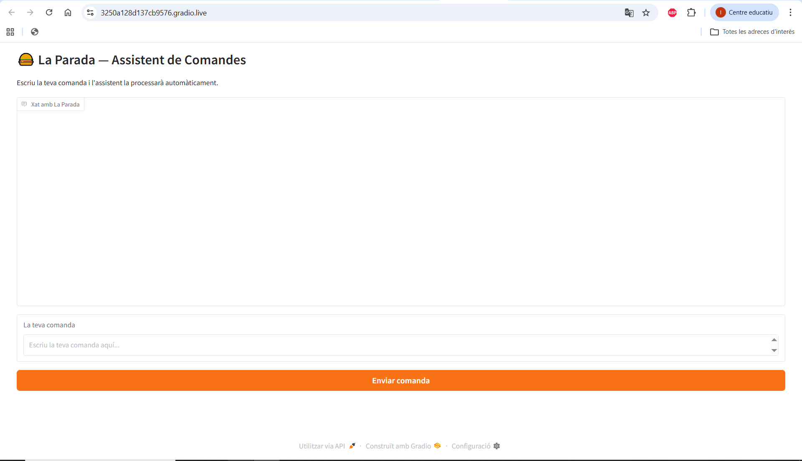
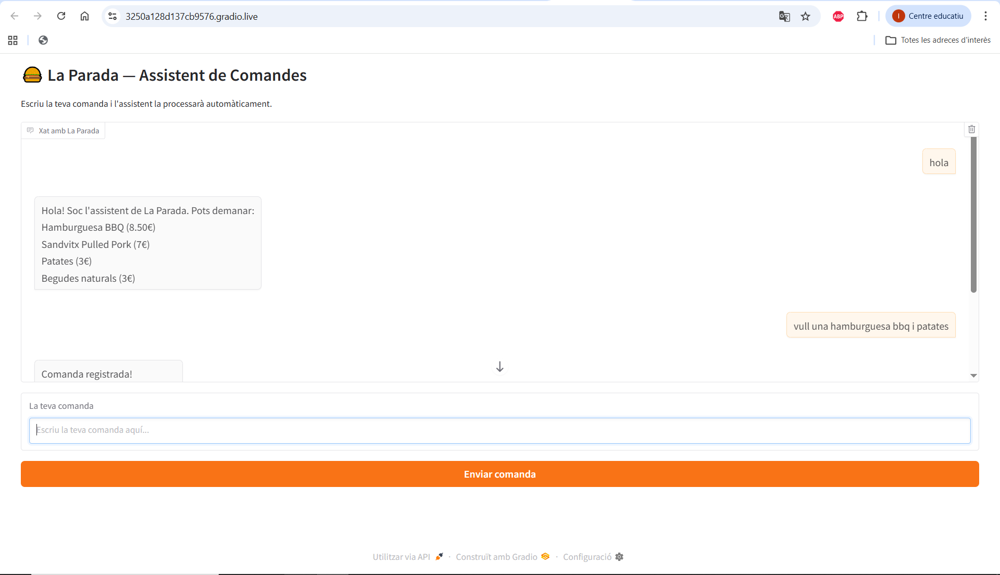
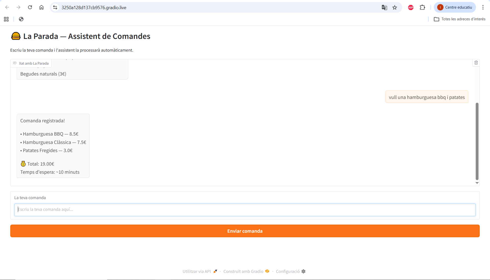

# La Parada — Assistent de Comandes IA

Prototip de chatbot intel·ligent per a la cadena de restaurants **La Parada** (8 locals a Barcelona).  
Permet als clients fer comandes en llenguatge natural i rep confirmació automàtica amb preu i temps d'espera.

---

## 5.1 Descripció del Prototip

### Què demostra el prototip
El prototip demostra la secció **2.2 del Document de Transformació Digital** de La Parada:  
el chatbot de comandes amb IA que substitueix les comandes per telèfon i WhatsApp (33% de les comandes actuals).

L'usuari escriu la seva comanda, la IA la processa, detecta els productes, consulta l'estoc disponible i retorna la confirmació amb el preu total i el temps d'espera estimat.

**Exemple de funcionament:**

### Tecnologies utilitzades
- **Python** — Llenguatge principal
- **Gradio** — Interfície web del chatbot
- **DialoGPT-medium (Microsoft / Hugging Face)** — Model d'IA
- **Google Colab** — Entorn d'execució

### Recursos gratuïts emprats
- Google Colab
- Hugging Face (DialoGPT)
- Gradio
- GitHub

---

## 5.2 Instruccions de Desplegament

### Requisits
- Compte de Google
- Navegador web

### Passos
1. Ves a [Google Colab](https://colab.research.google.com)
2. Clica **Archivo → Abrir cuaderno → GitHub**
3. Enganxa l'URL d'aquest repositori i obre `Projecte_digitalització.ipynb`
4. Executa totes les cel·les en ordre (**Entorno de ejecución → Ejecutar todas**)
5. Quan aparegui la URL pública (`https://xxxx.gradio.live`), obre-la al navegador

### Comandes de prova

Exemples:
vull una hamburguesa bbq i patates
una hamburguesa i un batut maduixa
sandvitx pulled pork i beguda natural
---

## 5.3 Captures / Demo

### Interfície principal

### Comanda en procés

### Resposta de la IA

---

## 5.4 Codi Font

📓 [`Projecte_digitalització.ipynb`](Projecte_digitalització.ipynb)

---

## Autors
- Hunain Mukhtar
- Ibai Esplugas

*Projecte de Digitalització — La Parada*
